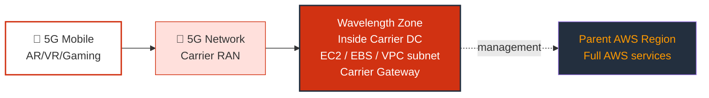
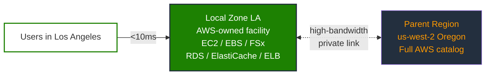

<table_of_contents color="blue"/>

# Section 10: Leveraging AWS Global Infrastructure — Part 3 (WaveLength, Local Zones, Global Architecture) {color="blue"}

<callout icon="🌍" color="blue_bg">
Part 3 of global infrastructure: **AWS Wavelength** (5G edge), **Local Zones** (city-adjacent AWS), and **multi-region architecture patterns** — plus a consolidated exam cheat sheet at the end.
</callout>

---

# AWS Wavelength {color="purple"}

## What is AWS Wavelength? {color="purple"}

- Brings AWS compute and storage to the **edge of 5G networks**
- Deploys AWS services inside **telecom carrier data centers** at the edge of 5G networks
- Enables **ultra-low latency** applications for mobile users
- Traffic stays on the telecom provider's network → **minimal latency** (traffic doesn't leave the carrier network for the edge hop)

## How It Works {color="purple"}

## Key Concepts {color="purple"}

- **Wavelength Zone**: AWS infrastructure deployment within a telecom provider's data center at the edge of 5G
- **Carrier Gateway**: Allows inbound traffic from the carrier network and outbound to the internet
- Wavelength Zones are **extensions of a VPC** — you create **subnets** in them
- Instances in **different Wavelength Zones cannot communicate directly** — use **Transit Gateway** (or similar patterns) for connectivity between WLZs

## Use Cases {color="purple"}

- **Real-time gaming** and interactive streaming
- **AR/VR** experiences
- **Autonomous vehicles** and connected cars
- **Smart factory** automation and IoT
- **Live video** streaming and media processing
- **Healthcare** training simulations
- **Online betting** in regulated markets (**data residency** / locality requirements)

## Telecom Partners {color="purple"}

<table header-row="true" fit-page-width="true">
<colgroup><col color="purple_bg"><col></colgroup>
<tr><td>**Partner**</td><td>**Region / Market**</td></tr>
<tr><td>Verizon</td><td>United States</td></tr>
<tr><td>Vodafone</td><td>Europe</td></tr>
<tr><td>KDDI</td><td>Japan</td></tr>
<tr><td>SK Telecom</td><td>Korea</td></tr>
<tr><td>Bell Canada</td><td>Canada</td></tr>
</table>

## Key Points for Exam {color="purple"}

<callout icon="🎯" color="yellow_bg">
**Exam framing**: Wavelength is specifically about **5G edge** placement inside **carrier facilities**, VPC subnet extension, **Carrier Gateway**, and **multi-WLZ connectivity via Transit Gateway** (not direct WLZ-to-WLZ).
</callout>

- Specifically for **5G edge** computing
- Ultra-low latency for mobile / connected devices
- Beyond standard EC2/EBS charges in the zone: understand positioning — you pay for **AWS resources you deploy** (no separate “Wavelength tax”; pricing follows the services you use)
- Partner ecosystem matters on exams when they test **who runs the edge** (carrier + AWS)

---

# AWS Local Zones {color="green"}

## What is AWS Local Zones? {color="green"}

- Extensions of an AWS Region that place **select services closer to end users**
- Provides **single-digit millisecond latency** for latency-sensitive applications
- High-bandwidth **private connectivity** back to the parent AWS Region
- You extend your VPC by creating a **subnet** in the Local Zone

## How It Works {color="green"}

## Local Zones vs Availability Zones vs Outposts {color="green"}

<table header-row="true" header-column="false" fit-page-width="true">
<colgroup><col color="gray_bg"><col><col><col></colgroup>
<tr><td>**Feature**</td><td>**Availability Zone**</td><td>**Local Zone**</td><td>**Outposts**</td></tr>
<tr><td>**Location**</td><td>In AWS Region</td><td>Near population centers</td><td>Your data center</td></tr>
<tr><td>**Services**</td><td>Full AWS services (regional)</td><td>Select services</td><td>Select services</td></tr>
<tr><td>**Managed by**</td><td>AWS</td><td>AWS</td><td>AWS (at your site)</td></tr>
<tr><td>**Latency story**</td><td>Low within Region</td><td>Single-digit ms to users in/near city</td><td>Lowest to local systems / on-prem adjacency</td></tr>
<tr><td>**Infrastructure**</td><td>AWS owned</td><td>AWS owned</td><td>AWS owned hardware, **your facility**</td></tr>
</table>

## When to Use Local Zones {color="green"}

- **Media & entertainment** — real-time content creation, video editing workflows
- **Machine learning inference** at the edge (latency-sensitive scoring)
- **Gaming** — multiplayer servers closer to player populations
- **Data residency** compliance (when locality matters at metro scope)
- Apps needing **~<10 ms** latency to end users in specific cities/metros

## Available Services {color="green"}

<callout icon="📌" color="green_bg">
Local Zones are **not** a full Region — expect **subset-of-services** questions on exams.
</callout>

- Amazon **EC2** (compute)
- Amazon **EBS** (storage)
- Amazon **FSx**
- **Elastic Load Balancing**
- Amazon **RDS**
- Amazon **ElastiCache**

## Key Points for Exam {color="green"}

- **AWS owned and operated** (contrast with **Outposts** at **your** site)
- **Subset of services** only (not the full Region catalog)
- Must be **opted into** — **not enabled by default**
- Extends your VPC via **subnets** in the Local Zone

---

# Global Applications Architecture {color="orange"}

## Architecture Patterns Comparison {color="orange"}

### 1. Single Region, Single AZ {color="orange"}

- No HA story, no global reach
- Simple and lower cost
- Risk: **single point of failure**

### 2. Single Region, Multi-AZ {color="orange"}

- **High availability inside a Region**
- Failover across AZs
- Common pattern for many production workloads

### 3. Multi-Region, Active-Passive {color="orange"}

- One Region handles reads/writes (**active**)
- Other Region **standby** for DR (**passive**)
- Often pairs with **Route 53 failover routing**
- Lower write/read latency only where the active Region serves users best

### 4. Multi-Region, Active-Active {color="orange"}

<callout icon="⚠️" color="orange_bg">
Active-active is the **highest complexity/cost** pattern — exams love asking what breaks if you don’t solve **data replication** and **conflict** semantics.
</callout>

- Both Regions serve traffic (**reads and writes**)
- Lowest global latency **when done correctly**
- Requires replication/sync primitives (examples: **DynamoDB Global Tables**, **Aurora Global Database**, plus app-level consistency choices)

## Choosing the Right Architecture {color="orange"}

<table header-row="true" fit-page-width="true">
<colgroup><col color="orange_bg"><col></colgroup>
<tr><td>**Need**</td><td>**Typical AWS Building Blocks**</td></tr>
<tr><td>Low-latency reads globally</td><td>**CloudFront** + **S3** (and/or origins behind CloudFront)</td></tr>
<tr><td>DNS-based routing</td><td>**Route 53** routing policies</td></tr>
<tr><td>Fast TCP/UDP performance</td><td>**Global Accelerator**</td></tr>
<tr><td>Uploads from far away</td><td>**S3 Transfer Acceleration**</td></tr>
<tr><td>On-premises AWS footprint</td><td>**Outposts**</td></tr>
<tr><td>5G edge ultra-low latency</td><td>**Wavelength**</td></tr>
<tr><td>City-level low latency</td><td>**Local Zones**</td></tr>
</table>

---

# Section Summary — Leveraging AWS Global Infrastructure {color="blue"}

## Service Quick Reference {color="blue"}

<table header-row="true" header-column="false" fit-page-width="true">
<colgroup><col color="blue_bg"><col><col></colgroup>
<tr><td>**Service**</td><td>**What It Does**</td><td>**Key Differentiator**</td></tr>
<tr><td>**Route 53**</td><td>DNS, domain registration, health checks</td><td>Routing policies (latency, geo, weighted, failover)</td></tr>
<tr><td>**CloudFront**</td><td>CDN — caches content at many edge locations</td><td>Layer 7 HTTP(S) caching + edge distribution</td></tr>
<tr><td>**S3 Transfer Acceleration**</td><td>Speeds up S3 uploads via edge</td><td>Upload acceleration over long distances</td></tr>
<tr><td>**Global Accelerator**</td><td>Anycast entry + AWS global network path</td><td>Layer 4-ish TCP/UDP focus; **static IPs**; not a cache</td></tr>
<tr><td>**Outposts**</td><td>AWS hardware/software **at your site**</td><td>Hybrid + locality + consistent AWS APIs on-prem</td></tr>
<tr><td>**Wavelength**</td><td>AWS inside **carrier** 5G edge sites</td><td>Ultra-low latency for **5G mobile** workloads</td></tr>
<tr><td>**Local Zones**</td><td>AWS **metro-adjacent** footprint</td><td>Single-digit ms story for city populations; subset services</td></tr>
</table>

## Key Exam Distinctions {color="blue"}

<callout icon="✅" color="yellow_bg">
**High-yield contrasts**
</callout>

- **CloudFront vs Global Accelerator**: CloudFront **caches HTTP(S)** content at the edge; Global Accelerator improves **network path / static IP entry** for TCP/UDP-friendly workloads — **no caching model like a CDN**
- **Outposts vs Local Zones**: Outposts = **your facility**; Local Zones = **AWS-operated** metro extensions of a Region
- **Wavelength vs Local Zones**: Wavelength = **5G carrier edge**; Local Zones = **general city/metro proximity**
- **S3 Transfer Acceleration vs CloudFront**: **S3TA accelerates uploads into S3**; CloudFront primarily accelerates **delivery to viewers** (downloads/reads)

---

<callout icon="📚" color="blue_bg">
**Study tip**: When a scenario mentions **5G + carrier + milliseconds for mobile**, think **Wavelength**. When it mentions **specific cities + VPC subnet extension + subset services**, think **Local Zones**. When it mentions **TCP/UDP + static IPs + global entry**, think **Global Accelerator**.
</callout>
