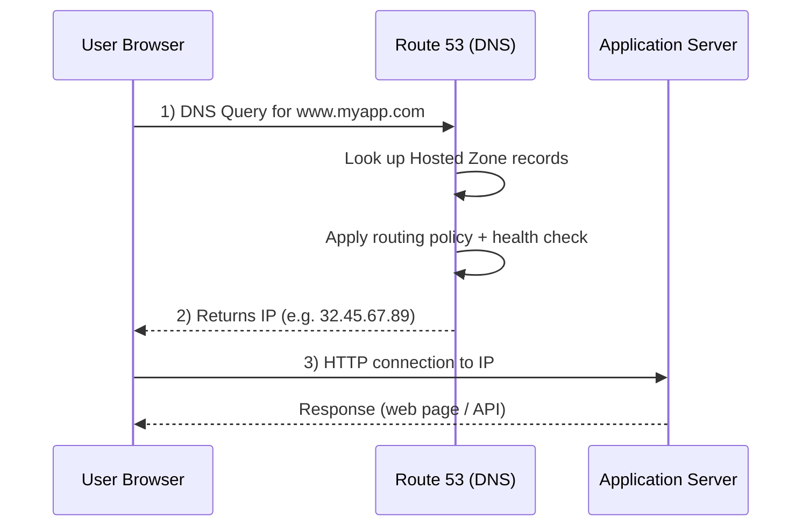
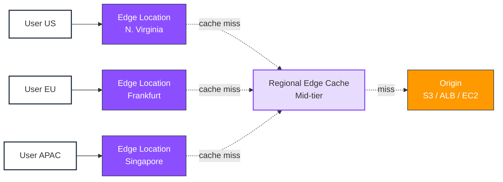

<table_of_contents color="blue"/>

<callout icon="🌍" color="blue_bg">
**Section 10 (Part 1)** covers core pieces of AWS global infrastructure: **Amazon Route 53** for DNS, routing, and health-aware traffic management, plus **Amazon CloudFront** for low-latency content delivery via a worldwide edge network.
</callout>

---

# Route 53 Overview {color="blue"}

## What is Route 53?

<callout icon="🔗" color="gray_bg">
**Amazon Route 53** is a highly available, scalable **DNS (Domain Name System)** web service. The name comes from **DNS port 53**.
</callout>

Route 53 provides four main functions:

1. **Domain Registration** — register domain names
2. **DNS Routing** — translates domain names (for example, example.com) to IP addresses (for example, 192.0.2.1)
3. **Health Checking** — monitors the health of your resources
4. **Traffic Management** — routes traffic globally using routing policies and routing logic

---

## Route 53 Routing Policies {color="purple"}

<table header-row="true" fit-page-width="true">
<colgroup><col color="purple_bg"><col></colgroup>
<tr><td>**Policy**</td><td>**Description**</td></tr>
<tr><td>**Simple**</td><td>Route to a single resource</td></tr>
<tr><td>**Weighted**</td><td>Route traffic in proportions you specify</td></tr>
<tr><td>**Latency-based**</td><td>Route to the region with lowest latency</td></tr>
<tr><td>**Failover**</td><td>Route to standby when primary is unhealthy</td></tr>
<tr><td>**Geolocation**</td><td>Route based on the user’s geographic location</td></tr>
<tr><td>**Geoproximity**</td><td>Route based on geographic location with bias</td></tr>
<tr><td>**Multi-value Answer**</td><td>Return multiple healthy records</td></tr>
<tr><td>**IP-based**</td><td>Route based on client IP addresses</td></tr>
</table>

<callout icon="🎯" color="yellow_bg">
**Study tip**: Match each policy to a scenario (for example, “split traffic for blue/green” → weighted; “closest healthy region” → latency-based; “country-specific compliance routing” → geolocation).
</callout>

---

## How Route 53 Works (Diagram) {color="green"}



1. User types `www.myapp.com` in a browser
2. The DNS query is resolved via Route 53 (hosted zone records)
3. Route 53 responds with an IP address (for example, 32.45.67.89)
4. The browser connects to the endpoint at that IP address

---

## Key Features {color="orange"}

- **DNS failover**: Automatically routes traffic away from unhealthy endpoints when paired with health checks and applicable routing configurations
- **Health checks**: Monitor endpoints on intervals such as **every 30 seconds** (and faster options like **10 seconds** for fast checks) from multiple global viewpoints
- **Traffic Flow**: Visual editor for composing more complex routing scenarios (where enabled / applicable to your workflow)
- **Private DNS**: Resolve names for internal AWS resources within a VPC (private hosted zones)
- **DNSSEC**: Helps protect against DNS spoofing / cache poisoning classes of attacks when implemented end-to-end
- **Route 53 Resolver**: Hybrid DNS plumbing to forward queries between VPCs and on-premises networks
- **DNS Firewall**: Filter / control outbound DNS queries (security-focused DNS filtering)

---

## Route 53 — Hands On Notes {color="brown"}

<callout icon="🛠️" color="brown_bg">
Use this as a lightweight lab checklist while you study—repeat until the steps feel automatic.
</callout>

- Register a domain or use an existing domain you control
- Create a **hosted zone** (**public** or **private**)
- Create DNS records (**A**, **AAAA**, **CNAME**, **alias records**, etc.)
- Associate **health checks** with records where failover/liveness matters
- Validate behavior by simulating failure (for example, stopping instances or blocking an endpoint) and observing routing changes

---

# CloudFront Overview {color="blue"}

## What is CloudFront?

<callout icon="⚡" color="blue_bg">
**Amazon CloudFront** is a **Content Delivery Network (CDN)** service that speeds up distribution of **static** and **dynamic** web content by serving it from locations closer to viewers.
</callout>

- Uses a global network of **edge locations** (often described as **450+ Points of Presence** across **48+ countries**—treat exact PoP counts as marketing numbers that change over time)
- Content can be cached at the edge nearest the user (depending on cache behavior and origin headers)

---

## How CloudFront Works {color="green"}

1. A user requests content (image, video, HTML/API responses, etc.)
2. DNS routes the request to a nearby CloudFront **edge location**
3. If content is **cached** → CloudFront serves it immediately (**cache hit**)
4. If content is **not cached** → CloudFront fetches from the **origin**, caches according to policy/TTL where applicable, then serves (**cache miss**)

---

## CloudFront Architecture {color="purple"}



```text
Users → Edge Locations → Regional Edge Caches → Origin (S3 / ALB / EC2 / HTTP Server)
```

<callout icon="📌" color="gray_bg">
**Memory hook**: Edge first (closest), regional edge as an intermediate caching tier for some assets/patterns, origin last—everything depends on your cache behaviors and headers.
</callout>

---

## CloudFront Origins {color="orange"}

- **Amazon S3 bucket**: Common for static objects; tighten access using **Origin Access Control (OAC)** (preferred modern pattern versus legacy OAI where applicable)
- **Custom origin (HTTP/S)**: **ALB**, **EC2**, **API Gateway**, **S3 website endpoints**, or any compatible HTTP backend
- **AWS Elemental MediaStore / MediaPackage**: Streaming-centric origins for video workflows

---

## CloudFront vs S3 Cross-Region Replication {color="red"}

<table header-row="true" fit-page-width="true">
<colgroup><col color="red_bg"><col><col></colgroup>
<tr><td>**Feature**</td><td>**CloudFront**</td><td>**S3 Cross-Region Replication**</td></tr>
<tr><td>**Global distribution**</td><td>Uses a large edge network (many PoPs)</td><td>Configured **per destination Region** (not an edge CDN model)</td></tr>
<tr><td>**Caching / freshness**</td><td>Cached for TTLs / policies; invalidate when needed</td><td>Replicas updated in near real-time (replication lag applies)</td></tr>
<tr><td>**Best for**</td><td>Read-heavy worldwide delivery from a small number of origins</td><td>Maintaining object copies across buckets/regions for durability/compliance/access patterns</td></tr>
<tr><td>**Typical write model**</td><td>Edge is primarily **read-focused** for cached content</td><td>Buckets remain **read/write** at the primary (replication is its own concern)</td></tr>
</table>

---

## Key Features {color="purple"}

- **Edge compute**: **CloudFront Functions** for lightweight request manipulation close to viewers; **Lambda@Edge** for more capable Node/Python runtimes at the edge (within supported limits)
- **SSL/TLS**: HTTPS delivery; integrate with ACM certificates for custom domains (where configured)
- **Geo restriction**: Allow/deny countries (use carefully—requirements vary by workload)
- **Price classes**: Reduce cost by restricting which edge locations participate (tradeoffs on global performance)
- **Origin groups**: Origin failover patterns between primary and secondary origins
- **Field-level encryption**: Protect sensitive fields end-to-end from the edge to your origin processing

---

## CloudFront — Hands On Notes {color="brown"}

<callout icon="✅" color="brown_bg">
Do these once in console + once “as code” (CDK/Terraform) if you can—exam intuition sticks faster with muscle memory.
</callout>

- Create a **CloudFront distribution**
- Choose an **origin** (commonly **S3** or **ALB**)
- Configure **cache behaviors** (paths, TTLs, query-string/header forwarding—know what exams emphasize)
- Configure **Origin Access Control** for private S3 origins (modern default mental model)
- Test using your domain (DNS to CloudFront) or the default domain name (`*.cloudfront.net`)
- Issue **cache invalidations** when you must force fresh objects after updates (invalidate has operational cost implications)

---

<callout icon="📚" color="blue_bg">
**Quick compare**: Route 53 answers “**what IP/name should the client use?**” CloudFront answers “**how do we serve content quickly/safely from nearby caches while honoring origins and behaviors?**”
</callout>
