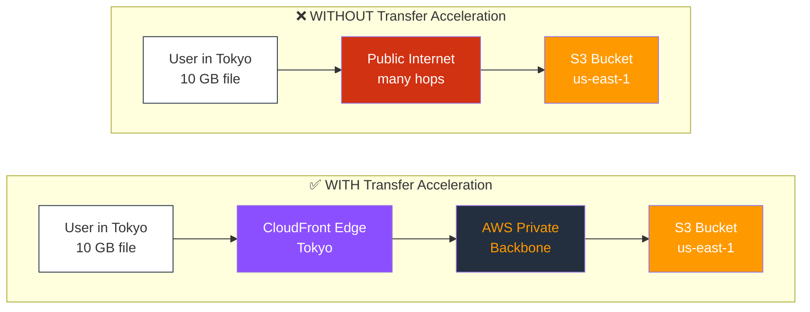
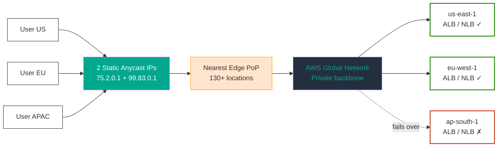
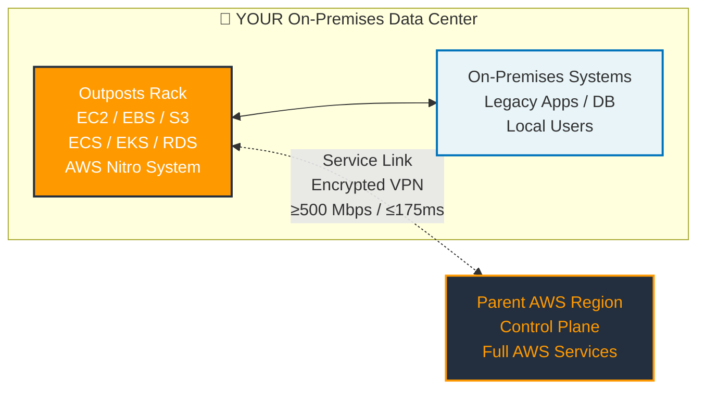

<table_of_contents color="blue"/>

# Section 10: Leveraging AWS Global Infrastructure — Part 2 (S3 Transfer Acceleration, Global Accelerator, Outposts) {color="blue"}

<callout icon="🚀" color="blue_bg">
Part 2 covers **performance and hybrid** services: **S3 Transfer Acceleration** for fast uploads, **AWS Global Accelerator** for network-level performance with static IPs, and **AWS Outposts** for running AWS on-premises.
</callout>

---

# S3 Transfer Acceleration {color="green"}

## What is S3 Transfer Acceleration? {color="green"}

- A bucket-level feature that speeds long-distance file transfers to/from Amazon S3
- Uses Amazon CloudFront's globally distributed **Edge Locations** (50+ locations)
- Routes data over AWS's optimized network paths instead of the public internet
- Can improve transfer speeds by **50–500%**

## How It Works {color="green"}

## When to Use S3 Transfer Acceleration {color="green"}

- Clients upload from **multiple geographic locations** to a centralized bucket
- Transferring **large objects** (GBs to TBs) across continents
- Regularly **underutilizing available bandwidth** over the internet
- Greater benefit the **farther** the client is from the S3 bucket Region

## Key Points for Exam {color="green"}

<callout icon="🎯" color="yellow_bg">
**Exam tips**: Know the endpoint pattern, pricing model, and bucket name requirements.
</callout>

- Additional **data transfer charges** apply
- Uses endpoint: `bucketname.s3-accelerate.amazonaws.com`
- Bucket name must be **DNS-compliant** (no periods)
- Only charged if acceleration **actually improves performance**
- **Speed Comparison Tool** available to test effectiveness
- Takes up to **20 minutes** to take effect after enabling

## S3 Transfer Acceleration vs CloudFront {color="green"}

<table header-row="true" fit-page-width="true">
<colgroup><col color="green_bg"><col><col></colgroup>
<tr><td>**Feature**</td><td>**S3 Transfer Acceleration**</td><td>**CloudFront**</td></tr>
<tr><td>**Direction**</td><td>Uploads AND Downloads</td><td>Primarily Downloads (reads)</td></tr>
<tr><td>**Use Case**</td><td>Large file transfers</td><td>Content distribution / caching</td></tr>
<tr><td>**Caching**</td><td>No caching</td><td>Caches at edge</td></tr>
<tr><td>**Protocol**</td><td>HTTP/HTTPS</td><td>HTTP/HTTPS</td></tr>
</table>

---

# AWS Global Accelerator {color="purple"}

## What is AWS Global Accelerator? {color="purple"}

<callout icon="🌐" color="purple_bg">
Think: **Layer 4**, **static Anycast IPs**, **AWS backbone routing** — NOT HTTP caching.
</callout>

- A networking service that improves **availability and performance** of applications
- Provides **2 static Anycast IP addresses** as fixed entry points
- Routes traffic over the **AWS global network** (not public internet)
- Operates at **Layer 4** (TCP/UDP) — network level
- Up to **60% better performance** compared to public internet

## How It Works {color="purple"}

## Key Features {color="purple"}

- **Static Anycast IPs**: 2 fixed IPs that never change (no DNS changes needed)
- **Health Checking**: Monitors endpoint health, automatic failover in **<30 seconds**
- **Traffic Dials**: Control % of traffic per region (blue/green deployments)
- **Client Affinity**: Route same client to same endpoint (stateful apps)
- **Fault Tolerance**: Independent Network Zones for high availability
- **TCP Termination at Edge**: Optimizes TCP connections
- **Custom Routing**: Direct traffic to specific EC2 instances
- **Bring Your Own IP (BYOIP)**: Use your own IP addresses

## Global Accelerator vs CloudFront {color="purple"}

<table header-row="true" fit-page-width="true">
<colgroup><col color="purple_bg"><col><col></colgroup>
<tr><td>**Feature**</td><td>**Global Accelerator**</td><td>**CloudFront**</td></tr>
<tr><td>**Layer**</td><td>Layer 4 (TCP/UDP)</td><td>Layer 7 (HTTP/HTTPS)</td></tr>
<tr><td>**Static IPs**</td><td>Yes (2 Anycast IPs)</td><td>No (uses DNS names)</td></tr>
<tr><td>**Caching**</td><td>No caching</td><td>Yes, caches content</td></tr>
<tr><td>**Best for**</td><td>Non-HTTP (gaming, IoT, VoIP)</td><td>HTTP content delivery</td></tr>
<tr><td>**Protocol**</td><td>TCP and UDP</td><td>HTTP/HTTPS/WebSocket</td></tr>
<tr><td>**Use case**</td><td>Performance + availability</td><td>Content distribution</td></tr>
</table>

## Use Cases {color="purple"}

- Gaming, IoT, Voice over IP
- HTTP use cases requiring **static IP addresses**
- HTTP use cases requiring **fast regional failover**
- Financial trading applications needing lowest latency

---

# AWS Outposts {color="orange"}

## What is AWS Outposts? {color="orange"}

<callout icon="🏢" color="orange_bg">
**Key concept**: AWS-managed hardware **on-premises** + Service Link to Region + NOT an offline island.
</callout>

- Fully managed service that extends **AWS infrastructure to your on-premises** data center
- AWS delivers and installs physical **Outposts Racks** or **Outposts Servers** at your location
- Same AWS hardware, APIs, tools, and services — but running **locally**
- AWS manages, monitors, and patches the infrastructure

## Two Form Factors {color="orange"}

<table header-row="true" fit-page-width="true">
<colgroup><col color="orange_bg"><col></colgroup>
<tr><td>**Type**</td><td>**Description**</td></tr>
<tr><td>**Outposts Rack**</td><td>Full 42U rack, standard AWS services</td></tr>
<tr><td>**Outposts Server**</td><td>1U/2U server for smaller spaces</td></tr>
</table>

## How It Works {color="orange"}

## When to Use AWS Outposts {color="orange"}

- **Low-latency** access to on-premises systems
- **Local data processing** requirements
- **Data residency** compliance (data must stay in-country)
- **Migration** of apps with local system dependencies
- Industries: Manufacturing, healthcare, financial services, media

## Key Services Available on Outposts {color="orange"}

- Amazon **EC2**, **EBS**, **S3** on Outposts
- Amazon **ECS**, **EKS** (containers)
- Amazon **RDS**, **ElastiCache**
- Amazon **EMR**
- **Application Load Balancer**

## Key Points for Exam {color="orange"}

<callout icon="⚠️" color="red_bg">
**Critical exam distinctions** for Outposts:
</callout>

- Requires minimum **500 Mbps** connection to parent AWS Region
- Latency to AWS Region must be **≤175ms**
- Uses **AWS Nitro System** for security
- **NOT** designed to work in disconnected/offline mode
- AWS handles delivery, installation, and ongoing management
- **You** are responsible for physical security of the facility
- Extends your VPC to on-premises (uses **Outpost subnets**)

---

<callout icon="📚" color="blue_bg">
**Quick compare**: S3 Transfer Acceleration = **fast uploads to S3**. Global Accelerator = **fast TCP/UDP path with static IPs**. Outposts = **AWS at your data center**.
</callout>
